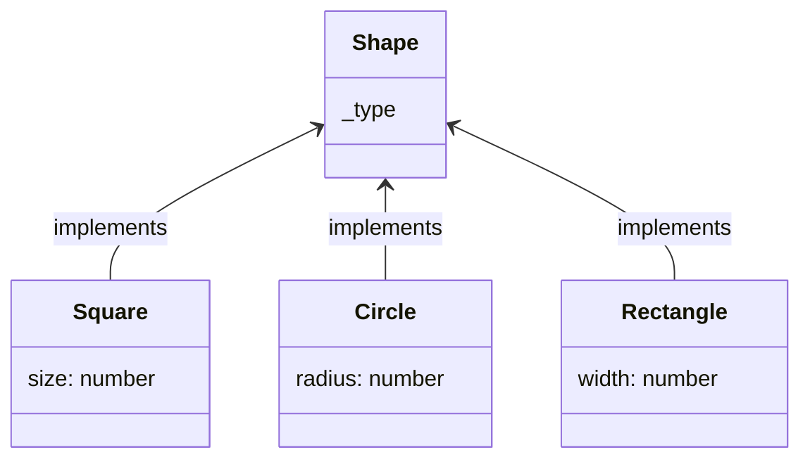

Suppose you have following object graph:

Create a component that retrieves a list of shapes from the server (use `ShapesService.getShapes()` function) and displays a form that allows to edit these shapes. Here are some constraints:
* Shapes can be of different type (circle, square, rectangle, etc.) and contain different set of properties (length, width, radius, etc.). 
* There can be any number of shapes in the list.
* The list can contain multiple shapes of the same type.

The form is saved by clicking "Save" button which should send all shapes back to the server (use `ShapesService.saveShapes()` function).

Bonus points:
* Calculate area of the shape and display it.
* Implement validation: values cannot be negative
* Implement functionality to add and remove shapes from the list.

In this repository you are provided with a starter project. It includes [ShapesService](/src/app/shapes.service.ts) which mimics http backend communication with some pre-defined data.
